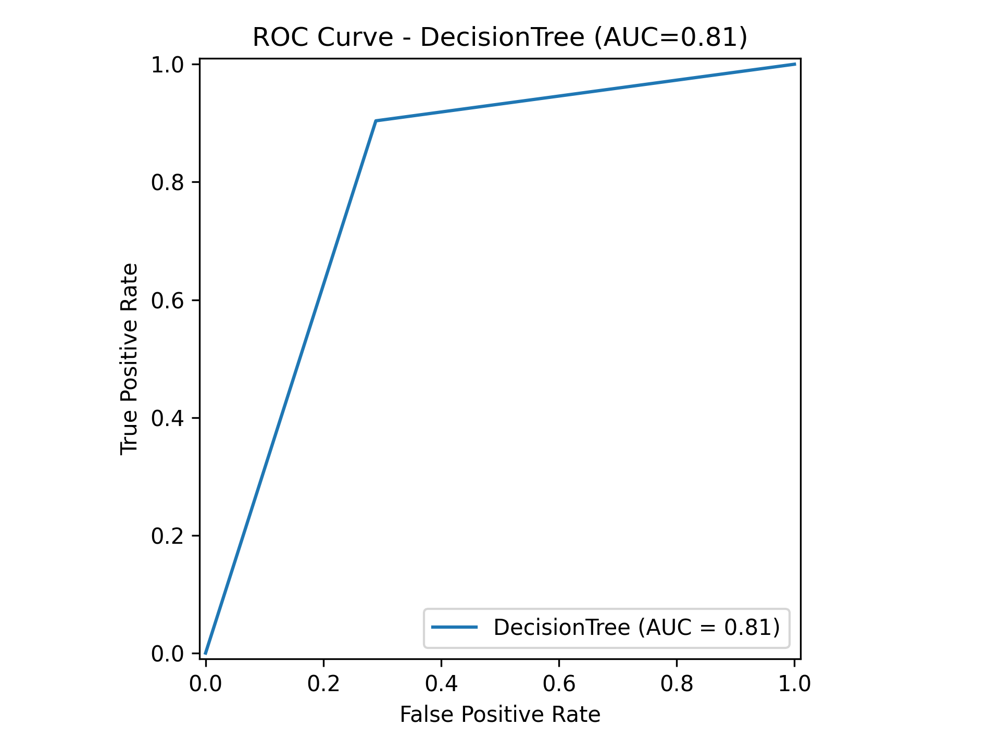

Heart Disease Risk Prediction

# **Heart Disease Risk Prediction**

## **1. Giới thiệu**

Dự án _Heart Disease Risk Prediction_ nhằm phát triển một mô hình trí tuệ nhân tạo (AI) để dự đoán nguy cơ mắc bệnh tim dựa trên các yếu tố sức khỏe và lối sống của một cá nhân. Bằng cách sử dụng các thuật toán học máy (Machine Learning), dự án giúp phát hiện sớm nguy cơ mắc bệnh, từ đó hỗ trợ các bác sĩ và bệnh nhân đưa ra quyết định điều trị và phòng ngừa hiệu quả hơn.

## **2. Mục tiêu của dự án**

-   Xây dựng một mô hình có khả năng dự đoán chính xác nguy cơ mắc bệnh tim.
-   Phân tích các yếu tố quan trọng ảnh hưởng đến nguy cơ mắc bệnh.
-   Tạo ra một hệ thống dễ sử dụng, có thể triển khai trong các ứng dụng y tế hoặc trang web hỗ trợ người dùng.

## **3. Dữ liệu sử dụng**

Dữ liệu được sử dụng trong dự án có thể đến từ các nguồn như:

-   **Tập dữ liệu Framingham Heart Study**, Cleveland Heart Disease dataset từ UCI Machine Learning Repository.
-   Các nguồn dữ liệu y tế khác, chứa thông tin về tuổi, huyết áp, cholesterol, chỉ số BMI, tiền sử bệnh tim, thói quen hút thuốc, tiểu đường, v.v.

## **4. Phương pháp tiếp cận**

### **4.1. Tiền xử lý dữ liệu**

-   Làm sạch dữ liệu, xử lý giá trị bị thiếu, chuẩn hóa dữ liệu.

### **4.2. Chọn mô hình học máy**

Một số thuật toán phổ biến được sử dụng gồm:

-   Hồi quy logistic (Logistic Regression)
-   Cây quyết định (Decision Tree)
-   Random Forest
-   Học sâu (Deep Learning - Neural Networks)

### **4.3. Đánh giá hiệu suất**

Sử dụng các chỉ số như:

-   Độ chính xác (Accuracy)
-   Độ nhạy (Recall)
-   Độ đặc hiệu (Specificity)
-   AUC-ROC để đánh giá mô hình

## **5. Ứng dụng thực tế**

-   Hỗ trợ bác sĩ đánh giá nguy cơ mắc bệnh tim của bệnh nhân.
-   Cung cấp công cụ kiểm tra sức khỏe trực tuyến cho người dùng.
-   Tích hợp vào các hệ thống y tế thông minh để đưa ra khuyến nghị về sức khỏe.

## **6. Kết luận**

Dự án _Heart Disease Risk Prediction_ giúp cải thiện khả năng phát hiện sớm bệnh tim, từ đó góp phần nâng cao chất lượng cuộc sống và giảm thiểu tỷ lệ tử vong do bệnh tim mạch.

## **7. Ma trận nhầm lẫn (Confusion Matrix)**

Dưới đây là ma trận nhầm lẫn của các mô hình:

-   **Decision Tree**

-   **Random Forest**

-   **Logistic Regression**

-   **Neural Network**

## **8. Đường cong ROC và AUC**

Đường cong ROC (Receiver Operating Characteristic) và chỉ số AUC (Area Under Curve) giúp đánh giá khả năng phân biệt giữa các lớp của mô hình. Dưới đây là các đường cong ROC cho từng mô hình:

-   **Decision Tree**

-   **Random Forest**

-   **Logistic Regression**

-   **Neural Network**

## **9. So sánh hiệu suất các mô hình**

Biểu đồ dưới đây so sánh độ chính xác (accuracy) của các mô hình học máy được sử dụng trong dự án:

## **10. Đóng góp và liên hệ**

-   Đóng góp: Mọi ý kiến đóng góp xin gửi về nhóm phát triển qua email hoặc GitHub.
-   Liên hệ: [Thông tin liên hệ nhóm phát triển]
